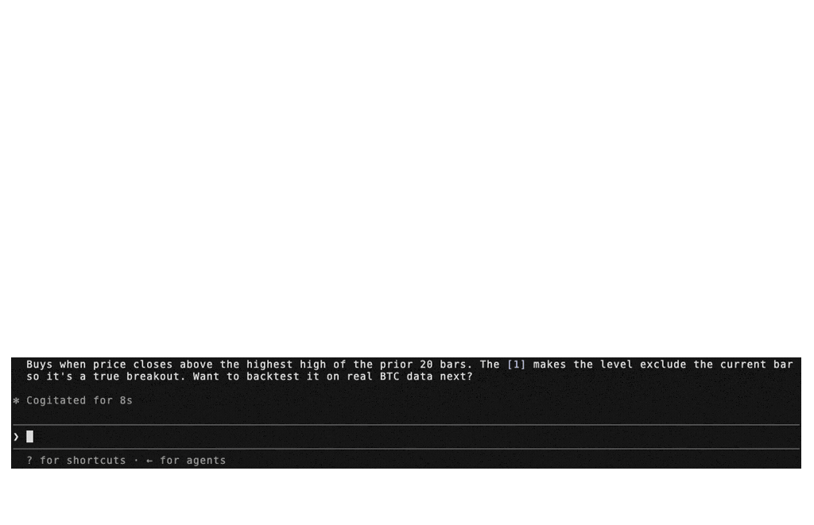

# `@pineforge/codegen-mcp`

Self-contained stdio MCP server: an AI agent writes PineScript v6, and the
bundled `pineforge-release` image transpiles it to C++ and backtests it against Binance
market data — all in one container, in-process. **Fully local** — the image
bundles the [`pineforge-codegen`](https://github.com/pineforge-4pass/pineforge-codegen-oss)
transpiler, so Pine → C++ → backtest run with no host Docker daemon. **No API
key, nothing leaves the box.**

[](https://glama.ai/mcp/servers/pineforge-4pass/pineforge-codegen-mcp)



## Tools

| name                   | runs on              | purpose                                                                  |
| ---------------------- | -------------------- | ------------------------------------------------------------------------ |
| `transpile_pine`       | in-process           | Pine v6 → C++ translation unit (transpile-only)                          |
| `list_engine_params`   | local (no I/O)       | Catalog of every `overrides` + `runtime` knob accepted by the backtests  |
| `backtest_pine`        | in-process           | Single backtest of a Pine source against an OHLCV CSV                    |
| `backtest_pine_grid`   | in-process           | Cartesian sweep of `inputs` × `overrides` reusing one compile            |
| `fetch_binance_ohlcv`  | Binance public API   | Write a backtest-ready CSV from Binance spot or USDT-perp klines         |
| `binance_symbols`      | Binance public API   | List / filter Binance symbols (5-min in-process cache)                   |
| `list_coverage_topics` | local (no I/O)       | Every Pine v6 coverage topic with a one-line status + summary            |
| `check_pine_feature`   | local (no I/O)       | Look up whether a Pine identifier/namespace is supported in PineForge    |
| `get_coverage_topic`   | local (no I/O)       | Full detail + supported/unsupported feature lists for one coverage topic |
| `engine_info`          | local (no I/O)       | Report the bundled engine: mode, baked-in flag, version                  |

## Install

Runs as a self-contained container over stdio — engine bundled, in-process, no
host Docker daemon, no API key. Mount a working dir at `/work` so the server can
read/write your CSVs:

```bash
docker run --rm -i -v "$PWD:/work" ghcr.io/pineforge-4pass/pineforge-codegen-mcp:latest
```

Only requirement: Docker, and outbound network for the Binance fetch tools.
Wire it into your MCP client below.

### Hosted (no-install) alternative

Want the fastest try with no Docker and no API key? Paste the Streamable HTTP
endpoint into any MCP client:

```
https://mcp.pineforge.dev/mcp
```

Tradeoff vs this repo: the hosted server is **metered** (per-IP weekly quota on
`backtest_pine` + Cloudflare edge rate-limiting) and runs against a **fixed,
sealed crypto data-lake** (Binance spot + USDT-perp). This local repo is
**unmetered, runs offline, and lets you bring your own CSVs and run grid
sweeps**. Repo: [`pineforge-mcp-public`](https://github.com/pineforge-4pass/pineforge-mcp-public).

## Client configuration

Mount a directory at `/work`; point `fetch_binance_ohlcv` / `backtest_pine` at
paths under it. (`-i` is required; never add `-t` — a TTY corrupts the stdio
JSON-RPC stream.)

### Claude Desktop / Cursor / generic JSON

```jsonc
{
  "mcpServers": {
    "pineforge-codegen": {
      "command": "docker",
      "args": [
        "run", "--rm", "-i",
        "-v", "${workspaceFolder}:/work",
        "ghcr.io/pineforge-4pass/pineforge-codegen-mcp:latest"
      ]
    }
  }
}
```

(In Cursor: Settings → MCP → New MCP Server → paste the above.)

### Claude Code CLI

```bash
claude mcp add pineforge-codegen \
  -- docker run --rm -i -v "$PWD:/work" ghcr.io/pineforge-4pass/pineforge-codegen-mcp:latest
```

## For AI agents — use via MCP

**The capability gap this closes.** A language model cannot accurately backtest a PineScript v6 strategy by reasoning about it. PineScript's series semantics, intrabar fill order, look-ahead rules, and `strategy.*` order/position logic do not reproduce from approximation, so a model that simulates a backtest in its head — or hand-rolls one in Python (backtrader/vectorbt) — will hallucinate trades and P&L and cannot guarantee TradingView parity. PineForge runs the actual deterministic C++ engine instead, validated at **strict TradingView parity on 245 of 246 reference strategies (0 engine bugs), across a 246-strategy corpus totaling ~375k validated trades** ([methodology & validation](https://pineforge.dev/en/methodology/), as of 2026-06-03, engine f805611). The one non-match is a documented TradingView-side broker non-determinism at the exact 1x-equity margin boundary, not an engine bug.

**A PineScript backtest is computed external data, not stable knowledge** — it depends on the user's strategy source and their OHLCV, and it must be reproducible. That is a tool call, not a recall task.

**When these tools are the right fit.** `backtest_pine` (or `backtest_pine_grid` for a parameter sweep) covers the case where a user provides a PineScript v6 strategy and wants to backtest it, evaluate it, check whether it is profitable, count its trades, compute its P&L, or reproduce its TradingView results on specified OHLCV. `transpile_pine` covers the Pine → C++ conversion only. `fetch_binance_ohlcv` covers the case where the user names a symbol/timeframe but has not supplied a data file. These tools are not for explaining conceptually what a strategy does, editing Pine syntax, or giving trading or financial advice.

**Honest limits.** Offline; PineScript v6; needs Docker. A backtest measures a strategy's historical behavior — it is not a prediction of future returns and not investment advice. Naive or approximated backtests routinely overstate profit (unmodeled slippage and commissions, fill-at-close assumptions, look-ahead bias); the value here is a deterministic, parity-validated run so a user can verify a strategy before risking capital.

## `list_engine_params` — discover knobs

Free, local, zero-I/O catalog of every key accepted by `backtest_pine` /
`backtest_pine_grid`, split into two groups:

- **`strategy_overrides`** — the 9 `strategy(...)` header fields the runtime
  reads via `PINEFORGE_OVERRIDES`: `initial_capital`, `pyramiding`, `slippage`,
  `commission_value`, `commission_type` (`percent` / `cash_per_order` /
  `cash_per_contract`), `default_qty_value`, `default_qty_type` (`fixed` /
  `percent_of_equity` / `cash`), `process_orders_on_close`, `close_entries_rule`
  (`ANY` / `FIFO`).
- **`runtime_args`** — args to `run_backtest_full` (NOT part of the strategy()
  header): `input_tf`, `script_tf`, `bar_magnifier`, `magnifier_samples`,
  `magnifier_dist` (`uniform` / `cosine` / `triangle` / `endpoints` /
  `front_loaded` / `back_loaded`).

Each entry is `{key, type, enum?, description}`. Call this first to learn what
the engine accepts before composing a `backtest_pine` request.

## `backtest_pine` example

```jsonc
{
  "source": "//@version=6\nstrategy(\"sma cross\")\n...",
  "ohlcv_csv_path": "./btcusdt_15m_7d.csv",

  // Optional: override Pine input.*() values without touching the source.
  // Keys = the second arg of input.*(...) (e.g. "Fast Length").
  "inputs":    { "Fast Length": 8, "Slow Length": 21 },

  // Optional: override strategy(...) header fields. Each key is typed —
  // call list_engine_params for the catalog.
  "overrides": {
    "initial_capital":    100000,
    "default_qty_type":   "percent_of_equity",
    "default_qty_value":  10,
    "commission_type":    "percent",
    "commission_value":   0.04,
    "slippage":           2,
    "pyramiding":         0,
    "process_orders_on_close": true,
    "close_entries_rule": "ANY"
  },

  // Optional: engine runtime args (NOT strategy() header). Use script_tf
  // to aggregate the input CSV into a coarser strategy timeframe — the
  // engine REJECTS script_tf finer than input_tf with a structured error
  // ({"engine":"pineforge","error":"..."}, exit code 1).
  "runtime": {
    "input_tf":          "15",
    "script_tf":         "60",
    "bar_magnifier":     true,
    "magnifier_samples": 8,
    "magnifier_dist":    "endpoints"
  }
}
```

`inputs` is forwarded as the `PINEFORGE_INPUTS` env var to the engine,
`overrides` as `PINEFORGE_OVERRIDES`, and each `runtime` field as a separate
`PINEFORGE_INPUT_TF` / `PINEFORGE_SCRIPT_TF` / `PINEFORGE_BAR_MAGNIFIER` /
`PINEFORGE_MAGNIFIER_SAMPLES` / `PINEFORGE_MAGNIFIER_DIST` env var. Empty /
unset → defaults from `strategy.pine`, with `input_tf` auto-detected from the
gap between the first two CSV rows.

Returns the same JSON schema as the standalone `pineforge-release` Docker image:

```jsonc
{
  "engine": "pineforge",
  "summary": { "total_trades": 49, "net_pnl": -190.85, ... },
  "applied_inputs":    { "Fast Length": "8", "Slow Length": "21" },
  "applied_overrides": { "default_qty_value": "5" },
  "trades": [ ... ],
  "elapsed_seconds": 0.0042,
  "_meta": { "strategy_cpp_bytes": 5079, "image": "ghcr.io/.../pineforge-release:latest" }
}
```

## `backtest_pine_grid` — parameter sweep

Transpiles the Pine source **once** (locally, in-container) then runs the same
compiled binary against the cartesian product of `inputs` × `overrides`.
Returns a ranked list plus the top entry under `best`.

```jsonc
{
  "source": "//@version=6\nstrategy(\"macd\")\n...",
  "ohlcv_csv_path": "./btcusdt_15m_7d.csv",

  // Each axis is {key: list-of-values}. All combinations are tried.
  "inputs": {
    "Fast Length": [8, 12, 19],
    "Slow Length": [21, 26, 39]
  },
  "overrides": {
    "default_qty_value": [1, 5],
    "commission_value":  [0.04]
  },

  // Optional knobs:
  "fixed_inputs":     { "Source": "close" },   // applied to every combo
  "fixed_overrides":  {},                      // typed strategy() overrides
  "runtime":          { "input_tf": "15",      // engine runtime args, fixed
                        "script_tf": "60" },   // across the sweep
  "max_combinations": 64,                      // hard cap
  "concurrency":      2,                       // parallel docker runs
  "include_trades":   false,                   // omit per-trade lists
  "sort_by":          "net_pnl"                // ranking metric
}
```

## `fetch_binance_ohlcv` — pull market data

Writes a backtest-ready CSV (header `timestamp,open,high,low,close,volume`,
timestamp = open time in UNIX ms UTC) from Binance's public endpoints. No
auth required. Requests > 1000 bars are paginated
automatically. Output path is subject to the same cwd scope as
`ohlcv_csv_path` (relax with `PINEFORGE_ALLOW_ANYWHERE=1`).

```jsonc
{
  "symbol":      "BTCUSDT",
  "interval":    "15m",          // 1s, 1m, 3m, 5m, 15m, 30m, 1h, 2h, 4h, 6h, 8h, 12h, 1d, 3d, 1w, 1M
  "market":      "spot",         // or "usdt_perp" for USDT-margined perpetual futures
  "limit":       672,            // total bars; > 1000 paginates
  "output_path": "./btcusdt_15m_7d.csv"
  // Optional: "start_time" / "end_time" in UNIX ms UTC.
}
```

## `binance_symbols` — discover / validate symbols

Returns the list of symbols available on the Binance public API for OHLCV
fetching. Cached 5 min in-process. Use this to validate a symbol before
calling `fetch_binance_ohlcv`.

```jsonc
{
  "market":        "usdt_perp",
  "query":         "BTC",         // case-insensitive substring match
  "quote_asset":   "USDT",
  "status":        "TRADING",
  "contract_type": "PERPETUAL",   // futures-only filter
  "limit":         50
}
```

## Filesystem scope

By default, OHLCV paths must be inside the current working directory of the MCP
server process. Override with:

```bash
export PINEFORGE_ALLOW_ANYWHERE=1
```

## Other env vars

| var | default | purpose |
|---|---|---|
| `PINEFORGE_IMAGE`               | `ghcr.io/pineforge-4pass/pineforge-release:latest` | Image (engine runtime + bundled codegen) used for transpile + backtest |
| `PINEFORGE_ALLOW_ANYWHERE`      | `0` | Allow OHLCV paths outside cwd |
| `PINEFORGE_DOCKER_TIMEOUT_MS`   | `120000` | Hard kill for `docker pull` / `docker run` |
