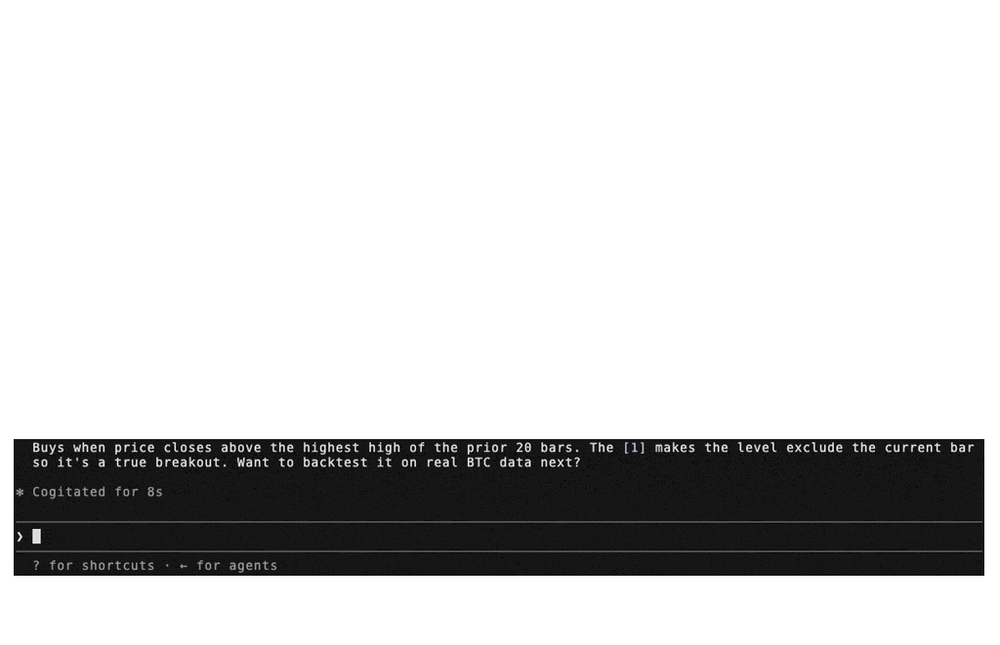

# `@pineforge/backtest-mcp`

Self-contained stdio MCP server: an AI agent writes PineScript v6, and the
bundled `pineforge-release` image transpiles it to C++ and backtests it against
an OHLCV CSV (your own, or one fetched from Binance's public API) — all in one
container, in-process. **Fully local** — the image bundles the
[`pineforge-codegen`](https://github.com/pineforge-4pass/pineforge-codegen-oss)
transpiler, so Pine → C++ → backtest run with no host Docker daemon. **No API
key.** Your strategy source and CSVs never leave the machine; only the Binance
tools, and `check_tradingview_parity` when you pass no bars, make outbound requests
(public endpoints).

[](https://glama.ai/mcp/servers/pineforge-4pass/pineforge-backtest-mcp)



## Tools

| name                   | runs on              | purpose                                                                  |
| ---------------------- | -------------------- | ------------------------------------------------------------------------ |
| `transpile_pine`       | in-process           | Pine v6 → C++ translation unit (transpile-only)                          |
| `list_engine_params`   | local (no I/O)       | Catalog of every `overrides` + `runtime` knob accepted by the backtests  |
| `backtest_pine`        | in-process           | Single backtest of a Pine source against an OHLCV CSV                    |
| `backtest_pine_grid`   | in-process           | Cartesian sweep of `inputs` × `overrides`: one transpile, then a compile and a backtest per combination |
| `check_tradingview_parity` | in-process (Binance public API only without your bars) | Grade your TradingView Strategy Tester export against PineForge's run of the same script, trade by trade |
| `fetch_binance_ohlcv`  | Binance public API   | Write a backtest-ready CSV from Binance spot or USDT-perp klines         |
| `binance_symbols`      | Binance public API   | List / filter Binance symbols (5-min in-process cache)                   |
| `list_coverage_topics` | local (no I/O)       | Every Pine v6 coverage topic with a one-line status + summary            |
| `check_pine_feature`   | local (no I/O)       | Look up whether a Pine identifier/namespace is supported in PineForge    |
| `get_coverage_topic`   | local (no I/O)       | Full detail + supported/partial/via_transpiler/unsupported lists for one topic |
| `engine_info`          | local (no I/O)       | Docker image only: mode, baked-in flag and the bundled `pineforge-release` version (for example `1.0.0`) |

The table is the Docker image's tool list (11 tools). The [npm package](#npm--npx)
serves the first ten, plus `pull_engine_image` (`docker pull` the engine image) and
`check_engine_image` instead of `engine_info` (12 tools).

## Install

Runs as a self-contained container over stdio — engine bundled, in-process, no
host Docker daemon, no API key. Mount the folder that holds your CSVs at `/work`:

```bash
docker run --rm -i -v "$PWD:/work" ghcr.io/pineforge-4pass/pineforge-backtest-mcp:latest
```

Only requirement: Docker, and outbound network for the Binance fetch tools.
Wire it into your MCP client below.

- **Use absolute `/work/...` paths** in tool arguments (`ohlcv_csv_path`,
  `output_path`, `report_path`). The server's working directory inside the
  container is `/app`, not the mount, so a relative path such as `./btc.csv`
  points into the container and is lost when it exits (`--rm`).
- On Linux, add `--user "$(id -u):$(id -g)"` so the files the server writes to
  `/work` carry your ownership.
- `-i` is required; never add `-t` — a TTY corrupts the stdio JSON-RPC stream.

The image's `:latest` and npm's `latest` always carry a stable release. A
`pineforge-release` prerelease (such as `1.0.0-rc.1`) produces a prerelease of this
server (`X.Y.Z-alpha.N`, `-beta.N` or `-rc.N`): the image `:vX.Y.Z-rc.N`, built FROM
that `pineforge-release` prerelease, and npm `@pineforge/backtest-mcp@next`, which,
like any npm install, runs the engine image named by `PINEFORGE_IMAGE` (default
`ghcr.io/pineforge-4pass/pineforge-release:latest`, the stable engine). Prereleases
are not listed in the MCP Registry. The first, 0.9.32-rc.1 on `pineforge-release`
1.0.0-rc.1, was published on 2026-09-30 (image `:v0.9.32-rc.1`, npm `next`).

### npm / npx

```bash
npx -y @pineforge/backtest-mcp
```

Needs Node ≥ 20 and a running Docker daemon: each transpile and backtest is a
`docker run --rm --network=none` of the engine image (`PINEFORGE_IMAGE`, default
`ghcr.io/pineforge-4pass/pineforge-release:latest`). `docker pull` it first: the
server's own pull (implicit on the first call, or `pull_engine_image`) is cut off
after `PINEFORGE_DOCKER_TIMEOUT_MS` (120 s by default). Paths are relative to the
server's working directory and, by default, confined to it (see
[Filesystem scope](#filesystem-scope)).

### Hosted (no-install) alternative

Want the fastest try with no Docker and no API key? Paste the Streamable HTTP
endpoint into any MCP client:

```
https://mcp.pineforge.dev/mcp
```

Tradeoff vs this repo: the hosted server is **metered** (100 `backtest_pine` runs
per week per IP, plus edge rate limits) and runs against OHLCV it resolves itself —
crypto only, seven venues (Binance, Bybit and OKX spot and USDT-perp; Coinbase spot),
the last 365 days, newest bar about an hour behind real time. Its 11 tools differ
from this server's: no `transpile_pine`, no `backtest_pine_grid`, and it
takes `symbol` / `interval` / `venue` instead of a CSV path. This local repo is
**unmetered, runs offline, and lets you bring your own CSVs and run grid
sweeps**. The hosted service's source is private.

## Client configuration

Mount a directory at `/work`; point `fetch_binance_ohlcv` / `backtest_pine` at
absolute paths under it (`/work/btc.csv`). (`-i` is required; never add `-t` — a TTY
corrupts the stdio JSON-RPC stream.)

### Claude Desktop

Edit `~/Library/Application Support/Claude/claude_desktop_config.json` (macOS) or
`%APPDATA%\Claude\claude_desktop_config.json` (Windows) and use an **absolute** host
path for the mount:

```jsonc
{
  "mcpServers": {
    "pineforge-backtest": {
      "command": "docker",
      "args": [
        "run", "--rm", "-i",
        "-v", "/absolute/path/to/your/data:/work",
        "ghcr.io/pineforge-4pass/pineforge-backtest-mcp:latest"
      ]
    }
  }
}
```

### Cursor

`.cursor/mcp.json` in the project (or `~/.cursor/mcp.json` for every project).
Cursor expands `${workspaceFolder}`:

```jsonc
{
  "mcpServers": {
    "pineforge-backtest": {
      "command": "docker",
      "args": [
        "run", "--rm", "-i",
        "-v", "${workspaceFolder}:/work",
        "ghcr.io/pineforge-4pass/pineforge-backtest-mcp:latest"
      ]
    }
  }
}
```

### Claude Code CLI

```bash
claude mcp add pineforge-backtest \
  -- docker run --rm -i -v "$PWD:/work" ghcr.io/pineforge-4pass/pineforge-backtest-mcp:latest
```

## For AI agents — use via MCP

**The capability gap this closes.** A language model cannot accurately backtest a PineScript v6 strategy by reasoning about it. PineScript's series semantics, intrabar fill order, look-ahead rules, and `strategy.*` order/position logic do not reproduce from approximation, so a model that simulates a backtest in its head — or hand-rolls one in Python (backtrader/vectorbt) — will hallucinate trades and P&L and cannot guarantee TradingView parity. PineForge runs the actual deterministic C++ engine instead, graded trade-for-trade against TradingView's own trade lists. At engine `35db01c8` (2026-09-29; engine 1.0.0 includes that commit and changed no grade): **7,989 graded probes, 7,905 excellent (98.95 %) and 84 strong (1.05 %), none below strong**, plus 17 further probes excluded as TradingView-side defects. Separately, the engine's own parity gate checks the open corpus [`pineforge-corpus`](https://github.com/pineforge-4pass/pineforge-corpus), which anyone can reproduce: 312 reference strategies, 311 excellent and 1 probe that declares `expected_tier: anomaly` in its `inputs.json` (reported as `anomaly`, not as a failure). *Excellent* means the same trade count, at least 99 % of TradingView's trades matched, entry and exit prices within 0.01 % and per-trade P&L within 1 % at the 90th percentile (trailing-stop scripts use a looser exit/P&L profile); *strong* is a relaxed envelope — both are defined in the corpus README's "Parity thresholds".

**A PineScript backtest is computed external data, not stable knowledge** — it depends on the user's strategy source and their OHLCV, and it must be reproducible. That is a tool call, not a recall task.

**When these tools are the right fit.** `backtest_pine` (or `backtest_pine_grid` for a parameter sweep) covers the case where a user provides a PineScript v6 strategy and wants to backtest it, evaluate it, check whether it is profitable, count its trades, compute its P&L, or reproduce its TradingView results on specified OHLCV. `transpile_pine` covers the Pine → C++ conversion only. `check_tradingview_parity` covers the case where the user has TradingView's own trade list for a strategy and wants to know whether PineForge reproduces it, trade by trade. `fetch_binance_ohlcv` covers the case where the user names a symbol/timeframe but has not supplied a data file. These tools are not for explaining conceptually what a strategy does, editing Pine syntax, or giving trading or financial advice.

**Honest limits.** Offline; PineScript v6 only; needs Docker; PineForge implements a subset of Pine v6 (see [Coverage tools](#coverage-tools)). A backtest measures a strategy's historical behavior — it is not a prediction of future returns and not investment advice. Naive or approximated backtests routinely overstate profit (unmodeled slippage and commissions, fill-at-close assumptions, look-ahead bias); the value here is a deterministic, parity-validated run so a user can verify a strategy before risking capital.

## `list_engine_params` — discover knobs

Free, local, zero-I/O catalog of every key accepted by `backtest_pine` /
`backtest_pine_grid`, split into two groups:

- **`strategy_overrides`** — the 9 `strategy(...)` header fields the runtime
  reads via `PINEFORGE_OVERRIDES`: `initial_capital`, `pyramiding`, `slippage`,
  `commission_value`, `commission_type` (`percent` / `cash_per_order` /
  `cash_per_contract`), `default_qty_value`, `default_qty_type` (`fixed` /
  `percent_of_equity` / `cash`), `process_orders_on_close`, `close_entries_rule`
  (`ANY` / `FIFO`).
- **`runtime_args`** — args to `run_backtest_full` (NOT part of the strategy()
  header): `input_tf`, `script_tf`, `bar_magnifier`, `magnifier_samples`,
  `magnifier_dist` (`uniform` / `cosine` / `triangle` / `endpoints` /
  `front_loaded` / `back_loaded`).

Each entry is `{key, type, enum?, description}`. Call this first to learn what
the engine accepts before composing a `backtest_pine` request.

## `backtest_pine` example

```jsonc
{
  "source": "//@version=6\nstrategy(\"sma cross\")\n...",
  "ohlcv_csv_path": "/work/btcusdt_15m_7d.csv",

  // Optional: override Pine input.*() values without touching the source.
  // Keys = the second arg of input.*(...) (e.g. "Fast Length").
  "inputs":    { "Fast Length": 8, "Slow Length": 21 },

  // Optional: override strategy(...) header fields. Each key is typed —
  // call list_engine_params for the catalog.
  "overrides": {
    "initial_capital":    100000,
    "default_qty_type":   "percent_of_equity",
    "default_qty_value":  10,
    "commission_type":    "percent",
    "commission_value":   0.04,
    "slippage":           2,
    "pyramiding":         0,
    "process_orders_on_close": true,
    "close_entries_rule": "ANY"
  },

  // Optional: engine runtime args (NOT strategy() header). Use script_tf
  // to aggregate the input CSV into a coarser strategy timeframe — the
  // engine REJECTS script_tf finer than input_tf, and the tool call then
  // fails (isError; "engine backtest failure (exit 4)" in the Docker image).
  "runtime": {
    "input_tf":          "15",
    "script_tf":         "60",
    "bar_magnifier":     true,
    "magnifier_samples": 8,
    "magnifier_dist":    "endpoints"
  },

  // Optional: where to write the full JSON report if it is too large to
  // return inline (see below). In Docker use an absolute path under /work.
  "report_path": "/work/report.json"
}
```

`inputs` is forwarded as the `PINEFORGE_INPUTS` env var to the engine,
`overrides` as `PINEFORGE_OVERRIDES`, and each `runtime` field as a separate
`PINEFORGE_INPUT_TF` / `PINEFORGE_SCRIPT_TF` / `PINEFORGE_BAR_MAGNIFIER` /
`PINEFORGE_MAGNIFIER_SAMPLES` / `PINEFORGE_MAGNIFIER_DIST` env var. Empty /
unset → defaults from `strategy.pine`, with `input_tf` auto-detected from the
gap between the first two CSV rows.

Returns the standalone `pineforge-release` image's report JSON (`engine`, `input`,
`summary`, `trades`, `metrics`, `equity_curve`, `fingerprint`, `applied_inputs`,
`applied_overrides`, `applied_runtime`, `diagnostics`, `elapsed_seconds`) plus a
`_meta` block, inline when it serializes to at most 200,000 bytes:

```jsonc
{
  "engine": "pineforge",
  "summary": { "total_trades": 49, "net_pnl": -190.85, ... },
  "applied_inputs":    { "Fast Length": "8", "Slow Length": "21" },
  "applied_overrides": { "default_qty_value": "5" },
  "trades": [ ... ],
  "equity_curve": [ ... ],
  "elapsed_seconds": 0.0042,
  "_meta": { "strategy_cpp_bytes": 5079, "image": "local" }   // npm/npx: the engine image name
}
```

A long run (3,000 hourly bars is enough) does not fit an MCP tool result. Then
the full report is written to `report_path` — default `pineforge-backtest-<timestamp>.json`
in the server's working directory — and the tool returns a compact result instead:

```jsonc
{
  "summary": { ... }, "applied_inputs": { ... }, "applied_overrides": { ... },
  "elapsed_seconds": 0.0008, "total_trades": 73,
  "report_path": "...", "report_path_in_container": "/work/report.json",
  "truncated": true, "note": "...", "_meta": { ... }
}
```

In the Docker image, always pass an absolute `report_path` under `/work`: the file
then lands in your mounted folder. Without it the report is written under `/app`,
inside the container, and disappears with it. (`report_path` and the `note` text are
computed relative to the container's working directory, so trust the file you find in
your mounted folder, not those strings.) The inline limit is `PINEFORGE_MAX_INLINE_BYTES`.

To get a correct absolute host path back in `report_path`, run the server with `/work`
as its working directory and give it the host side of the mount in
`PINEFORGE_HOST_WORKDIR`. The image's entrypoint is a path relative to `/app`, so this
takes an explicit `--entrypoint`; relative tool paths then resolve inside the mount too:

```bash
docker run --rm -i -v "$PWD:/work" -w /work -e PINEFORGE_HOST_WORKDIR="$PWD" \
  --entrypoint node ghcr.io/pineforge-4pass/pineforge-backtest-mcp:latest /app/dist/index.local.js
```

With the plain `docker run` of [Install](#install) (working directory `/app`),
`PINEFORGE_HOST_WORKDIR` still makes `report_path` absolute, but wrong: it is joined
with the report's path relative to `/app`.

## `backtest_pine_grid` — parameter sweep

Transpiles the Pine source **once** (locally, in-container), then compiles and
runs that C++ for each combination in the cartesian product of `inputs` ×
`overrides`: every combination is a fresh `g++` build of the same translation
unit, then its backtest. Returns a ranked list plus the top entry under `best`.

```jsonc
{
  "source": "//@version=6\nstrategy(\"macd\")\n...",
  "ohlcv_csv_path": "/work/btcusdt_15m_7d.csv",

  // Each axis is {key: list-of-values}. All combinations are tried.
  "inputs": {
    "Fast Length": [8, 12, 19],
    "Slow Length": [21, 26, 39]
  },
  "overrides": {
    "default_qty_value": [1, 5],
    "commission_value":  [0.04]
  },

  // Optional knobs:
  "fixed_inputs":     { "Source": "close" },   // applied to every combo
  "fixed_overrides":  {},                      // typed strategy() overrides
  "runtime":          { "input_tf": "15",      // engine runtime args, fixed
                        "script_tf": "60" },   // across the sweep
  "max_combinations": 64,                      // default 64, at most 1024; a bigger grid is an error
  "concurrency":      2,                       // parallel runs: default 1, at most 8
  "include_trades":   false,                   // default false: omit per-trade lists
  "sort_by":          "net_pnl",               // net_pnl (default) | win_rate_pct | max_drawdown | total_trades
  "report_path":      "/work/grid.json"        // where an oversized sweep is written
}
```

The result has `total_combinations`, `succeeded`, `failed`, `sort_by`, `best`, and
`results` (successful runs ranked by `sort_by`, descending, then failures). A sweep
too large to return inline is written to `report_path` and the tool returns `best`,
the top 10 in `top_results`, `results_truncated` and `report_path`.

## `check_tradingview_parity` — grade your TradingView results

Give it a Pine v6 script and TradingView's own Strategy Tester export for it. It
runs the script on the same market and window and grades the two trade lists
trade by trade with the grader behind PineForge's published parity figures:
`scripts/verify_corpus.py` of pineforge-engine v1.0.1 (sha256
`de84d5150ac0a29b67906f1f8b6fe1f1f13ac66ed36be88ea2bc63d7280ed298`), run through
the corpus gate's own harness (`scripts/run_strategy.py`). Both are vendored
unchanged under [`parity/vendor/`](parity/vendor/SHA256SUMS). Checked against the
open [`pineforge-corpus`](https://github.com/pineforge-4pass/pineforge-corpus) at
`a35c7c4`: inside this Docker image the grading core returns the published tier for
all 309 probes the corpus gate grades, and the tool itself, called over stdio with
only the inputs below, returns it for a stratified sample of 30.

```jsonc
{
  "pine": "//@version=6\nstrategy(\"my strategy\")\n...",
  // The "List of trades" CSV as TradingView exports it, or the Strategy Tester
  // XLSX report base64-encoded (it starts with UEsDB).
  "tradingview_trades": "Trade number,Type,Date and time,Signal,Price USDT,...",
  "symbol": "BINANCE:ETHUSDT.P",          // TradingView ticker
  "timeframe": "15",                      // TradingView resolution: 1, 5, 15, 60, 240, 1D, ...
  "range_start": "2025-04-01T00:00:00Z",  // first bar TradingView computed (UTC unless an offset is given)
  "chart_timezone": "Asia/Taipei",        // the timezone TradingView printed the trade times in

  // Optional:
  "range_end": "2025-10-01T00:00:00Z",    // default: the export's last row
  "inputs": { "Fast Length": 8 },         // TradingView's Inputs tab, as in backtest_pine
  "strategy_overrides": { "commission_value": 0.04 },  // TradingView's Properties tab (list_engine_params)
  "runtime": { "bar_magnifier": true },   // list_engine_params runtime args
  "max_mismatches": 10,                   // mismatching trades to list: default 10, at most 50
  "ohlcv_csv_path": "/work/eth_15m.csv"   // or "ohlcv_csv": "<CSV text>": your own bars
}
```

| input | notes |
|---|---|
| `pine` | Pine v6 source, at most 256 KiB |
| `tradingview_trades` | "List of trades" CSV text (columns `Trade number`, `Type`, `Date and time`, a `Price` column), or the XLSX report as base64 |
| `symbol` | TradingView ticker; required unless the XLSX states it or you pass bars |
| `timeframe` | TradingView resolution; required unless the XLSX states it |
| `range_start` | ISO 8601 date or datetime of the first bar of the backtest; required unless the XLSX states it |
| `range_end` | optional; default: the export's last row (the result says so) |
| `chart_timezone` | IANA name of the timezone the trade times are printed in (`UTC+8` style offsets are accepted); required unless the export states it; TradingView's "Exchange" setting is not guessed |
| `inputs`, `strategy_overrides`, `runtime` | optional, the same keys as `backtest_pine` |
| `max_mismatches` | optional, default 10, at most 50 |
| `ohlcv_csv` / `ohlcv_csv_path` | your bars, so any market works: `timestamp,open,high,low,close,volume` (epoch ms) or TradingView's chart export `time,open,high,low,close,Volume` (epoch seconds or ISO 8601); paths follow the [`backtest_pine` rules](#filesystem-scope) |

**Bars.** Your `ohlcv_csv` / `ohlcv_csv_path` when given. Otherwise `BINANCE:<SYMBOL>`
is fetched as Binance spot klines and `BINANCE:<SYMBOL>.P` as USDT-M perpetual klines,
from the public API, at most 100,000 bars. Any other symbol without bars is an error
that asks for them. There is no input for a finer (1m) magnifier feed: a script that
declares `use_bar_magnifier = true` runs as the corpus gate runs such scripts, without
one.

**XLSX report.** The "List of trades" sheet is read as the CSV would be (Excel dates
become `YYYY-MM-DD HH:MM`). The "Properties" sheet supplies the symbol, timeframe,
date range, initial capital, order size, pyramiding, commission, slippage and the fill
options it states; you can pass the same settings explicitly, but a value that
disagrees with the export is an error naming both. Strategy inputs listed in the
export are reported, not applied: pass `inputs` for any you changed. TradingView does
not document this layout, so sheet and key names are matched loosely and unknown keys
are ignored.

**Result.** A plain-text block and the same data as JSON (`structuredContent`): the
tier and what it means, every check with its value and thresholds, how many trades
matched and how many are TradingView-only or PineForge-only, the first mismatches side
by side with a hint where the data shows one (window edge, a position open at the range
end, size, commission or slippage, timezone), a timezone check, the window, and the
engine, codegen and grader versions. Trades pair when they have the same direction, an
entry within one hour and an entry price within $3. If most matched trades sit at the
same non-zero offset, or another timezone matches clearly more trades, the result says
so; the tier stays the one under the timezone you gave.

**Tiers**, as `verify_corpus.py` v1.0.1 grades them. Count Δ is
`|TradingView − PineForge| / max(TradingView, PineForge)` trades; the p90 values are
90th percentiles of per-trade relative differences over matched trades; coverage is
matched trades over all closed TradingView trades.

| tier | rule |
|---|---|
| excellent | equal trade counts; coverage ≥ 99 % or at most 1 unmatched trade; entry price p90 < 0.01 %; exit price p90 < 0.01 % (production profile: < 0.05 %); P&L p90 < 1 % (production profile: < 100 %); where TradingView shows several entries at one time and price, PineForge has as many |
| strong | coverage ≥ 95 % or at most 1 unmatched trade; count Δ < 6 %; entry price p90 < 0.1 %; exit price p90 < 0.5 %; P&L p90 < 100 % |
| moderate | coverage ≥ 75 % and at least 90 % of TradingView's trades matched |
| weak | at least one trade matched |
| minimal | no trade matched |

The production profile applies when the script sets `trail_points`, `trail_offset` or
`trail_price` on `strategy.exit`; every other script is graded on the strict profile.
Method: <https://pineforge.dev/en/methodology/>.

**Retention.** Everything runs on your machine; market data is fetched from Binance
only when you do not pass bars. The script and the trade list, and bars that had to
be converted or fetched, go to temporary folders that are deleted when the check
ends. With npm/npx the check runs in
the engine image (`docker run --network=none`, the grading core and your bars mounted
read-only).

## `fetch_binance_ohlcv` — pull market data

Writes a backtest-ready CSV (header `timestamp,open,high,low,close,volume`,
timestamp = open time in UNIX ms UTC) from Binance's public endpoints. No
auth required. Requests > 1000 bars are paginated
automatically. `output_path` follows the same rules as `ohlcv_csv_path`: in Docker
use an absolute path under `/work`; with npx it must stay inside the working
directory unless `PINEFORGE_ALLOW_ANYWHERE=1`.

```jsonc
{
  "symbol":      "BTCUSDT",
  "interval":    "15m",          // 1s (spot only), 1m, 3m, 5m, 15m, 30m, 1h, 2h, 4h, 6h, 8h, 12h, 1d, 3d, 1w, 1M
  "market":      "spot",         // default; or "usdt_perp" for USDT-margined perpetual futures
  "limit":       672,            // total bars: default 1000, at most 100000; > 1000 paginates
  "output_path": "/work/btcusdt_15m_7d.csv"
  // Optional: "start_time" / "end_time" in UNIX ms UTC.
}
```

## `binance_symbols` — discover / validate symbols

Returns the list of symbols available on the Binance public API for OHLCV
fetching. Cached 5 min in-process. Use this to validate a symbol before
calling `fetch_binance_ohlcv`.

```jsonc
{
  "market":        "usdt_perp",   // required: "spot" or "usdt_perp"
  "query":         "BTC",         // case-insensitive substring match
  "quote_asset":   "USDT",
  "base_asset":    "BTC",
  "status":        "TRADING",
  "contract_type": "PERPETUAL",   // futures-only filter
  "limit":         50             // default 200, at most 2000
}
```

## Coverage tools

PineForge implements a **subset** of Pine v6, so check before you write or port a
strategy:

- `list_coverage_topics` — every coverage topic with a status (`supported`,
  `partial`, `unsupported`, `via_transpiler`) and a summary, plus the legend.
- `get_coverage_topic` `{ "topic": "ta" }` — the full `supported` / `partial` /
  `via_transpiler` / `unsupported` lists for one topic id (for example `ta`,
  `strategy_orders`, `request_security`).
- `check_pine_feature` `{ "feature": "ta.supertrend" }` — one identifier or namespace:
  `supported` / `partial` / `unsupported` / `via_transpiler` / `not_found`, with a note
  that quotes the catalog entry. Plots, tables and alerts (`plot`, `bgcolor`, `table`,
  `alert`) are accepted and have no effect; `line`, `box` and `label` objects are data
  the strategy can read back.

Every status describes what a backtest through this server can do. The server
installs no other symbol's bars, no recorded request data and no Pine library
sources, so where the engine supports more, the entry says so: `request.security`
on another symbol, for example, is supported by the engine, but here a request whose
value can reach a trade stops the run.

The data is embedded in this package and stamped by the `coverage_version` field
that `list_coverage_topics` returns (`engine v1.0.1 + codegen 1.0.1 (2026-10-02)` in
this version); the engine's
[`docs/coverage.md`](https://github.com/pineforge-4pass/pineforge-engine/blob/v1.0.1/docs/coverage.md)
at that tag is the reference it was checked against.

## Filesystem scope

With `npx`, OHLCV, output and report paths must be inside the current working
directory of the MCP server process by default. Override with:

```bash
export PINEFORGE_ALLOW_ANYWHERE=1
```

The Docker image sets `PINEFORGE_ALLOW_ANYWHERE=1` itself (the container is the
sandbox), so any path is accepted there — use absolute `/work/...` paths.

## Other env vars

| var | default | purpose |
|---|---|---|
| `PINEFORGE_IMAGE`               | `ghcr.io/pineforge-4pass/pineforge-release:latest` | npm/npx only: engine image (runtime + bundled codegen) used for transpile + backtest |
| `PINEFORGE_ALLOW_ANYWHERE`      | `0` (`1` in the Docker image) | Allow OHLCV / output / report paths outside cwd |
| `PINEFORGE_DOCKER_TIMEOUT_MS`   | `120000` | Hard kill for each engine run and for `docker pull` |
| `PINEFORGE_MAX_INLINE_BYTES`    | `200000` | Largest report returned inline; bigger ones are written to `report_path` |
| `PINEFORGE_PARITY_TIMEOUT_MS`   | `600000` | Time limit of one `check_tradingview_parity` run (transpile, compile, backtest, grading) |
| `PINEFORGE_HOST_WORKDIR`        | unset | Docker: the host dir mounted at `/work`; when set, `report_path` is an absolute host path — correct only when the server runs with `/work` as its working directory (see the end of [`backtest_pine` example](#backtest_pine-example)) |

With Docker, pass these as `-e NAME=value`.

## Develop

```bash
npm ci
npm run build     # tsc; also writes the gitignored src/version.ts
npm test
```

To build the image, pass the `pineforge-release` version to build on (a tag from
its Releases page, without the `v`):

```bash
docker build -f docker/Dockerfile --build-arg PINEFORGE_RELEASE_VERSION=<X.Y.Z> -t pineforge-backtest-mcp .
```

## License

This server is MIT-licensed ([LICENSE](LICENSE)). The image also bundles
`pineforge-engine` (Apache-2.0) and the `pineforge-codegen` transpiler
(source-available: PolyForm Noncommercial 1.0.0 with a Personal Trading exception;
commercial or hosted use needs a commercial license). See [LEGAL.md](LEGAL.md).
